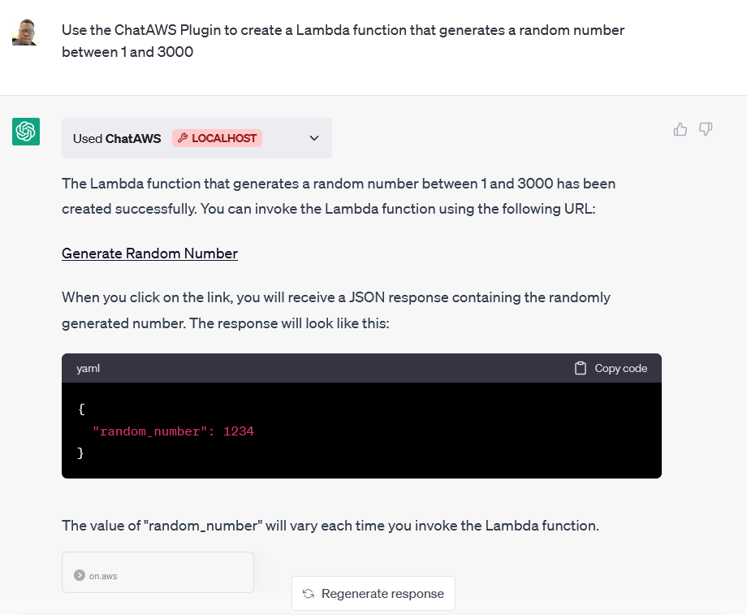

<h1 align="center">ChatAWS</h1>

<p align="center">
   Create AWS Lambda functions and websites in Amazon S3 using ChatGPT.
</p>

<!-- https://user-images.githubusercontent.com/696254/232276725-b497f0a5-1be6-48c4-a156-5ef0bb6d3973.mp4
 -->
https://github.com/banjtheman/chataws/assets/696254/f8c2924d-531a-41a4-a03b-e9c2556c60d1

## Features

- Create AWS Python Lambda functions with or without dependencies.
- Create Static websites using Amazon S3.

## Prerequisites

To use this plugin, you will need the following:

- Docker
- An AWS account with access to S3 and Lambda services

## Installation

Clone the repository:

```bash
git clone https://github.com/banjtheman/chataws.git
```

Change to the repository directory:

```bash
cd chataws
```

Build the Docker image:

```bash
docker build . -t aws_chatgpt_plugin
```

## Setup

You will need to setup AWS access keys that can do the following.
 * Put Object to the designated bucket
* Create Lambda Functions
* Create Lambda Function URL

In addition, you must create a Lambda Role for the app to use, as well as provide an S3 bucket that allows public objects.

## Start Docker

Run the Docker container with the required environment variables:

```bash
docker run -p PORT:PORT \
-e AWS_DEFAULT_REGION=<your_aws_region> \
-e AWS_ACCESS_KEY_ID=<your_aws_access_key> \
-e AWS_SECRET_ACCESS_KEY=<your_aws_secret_key> \
-e LAMBDA_ROLE=<your_lambda_role_arn> \
-e S3_BUCKET=<your_s3_bucket_name> \
-e PORT=PORT \
aws_chatgpt_plugin
```

Once up you can follow the instructions [here](https://platform.openai.com/docs/plugins/getting-started/running-a-plugin) to run the plugin within ChatGPT,


## Example Prompts

You can test the plugin with some of these prompts:

* Use the ChatAWS Plugin to create a Lambda function that generates a random number between a min and a max number input from a user
* Use the ChatAWS Plugin to create a website in that invokes the Lambda Function and displays the random number each time a button is pressed, and lets the user change the min and max values
* Use the ChatAWS Plugin to create a Lambda function that uses the VADER Sentiment Analysis library to perform sentiment analysis on input text
* Use the ChatAWS Plugin to create a website that invokes the sentiment analysis Lambda Function on an input string from a text box.


## Example Outputs
<div align="center"></div>


## Contributing

Contributions are welcome! If you have any suggestions, bug reports, or feature requests, please create an issue or submit a pull request.

## License

This project is licensed under the MIT License. See the LICENSE file for details.

## Support

If you need help or have any questions, please feel free to open an issue or contact the maintainer.
